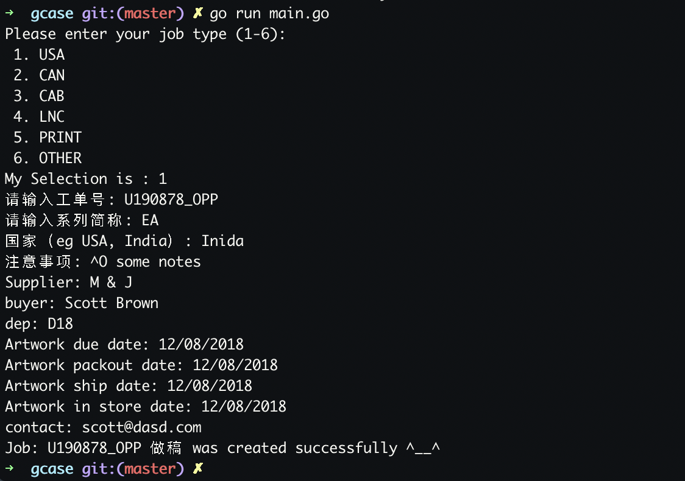

# gcase
A cli written with golang to generator daily jobs
### install
```
git clone https://github.com/scott-x/gcase.git
# 编译前需手动修改parse/readExcel.go中的project_folder
go build main.go && mv main $GOPATH/bin/gcase
```
### useage
```
gcase
```
### A IMAGE FOR OVERVIEW

