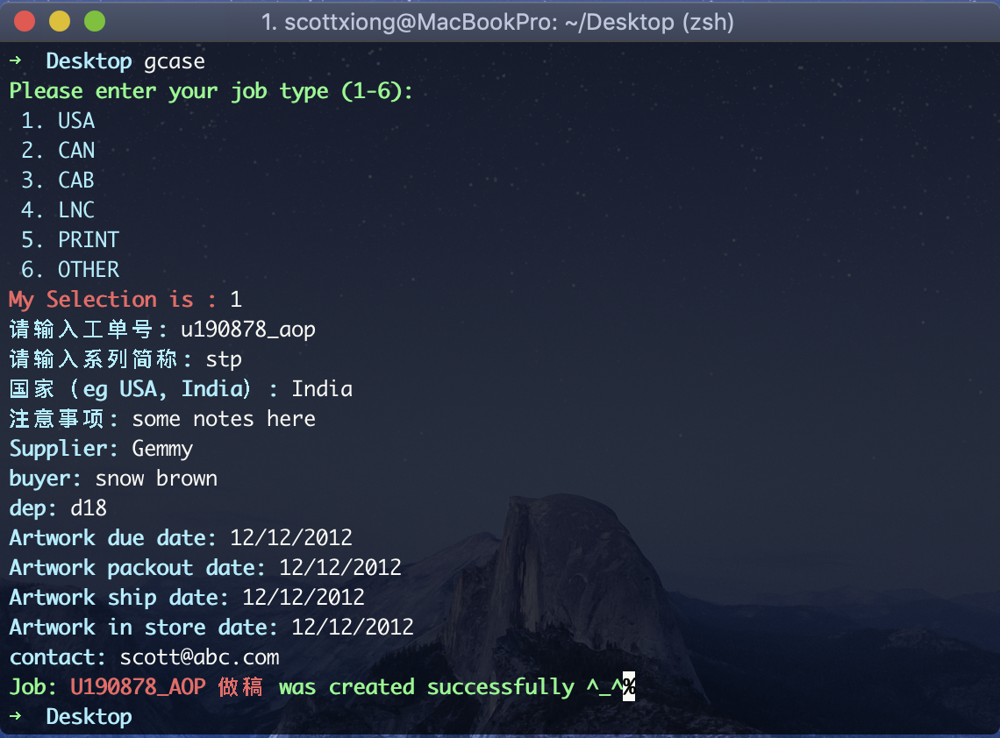

# gcase
A cli written with golang to generator daily jobs
### install
```
git clone https://github.com/scott-x/gcase.git
# before building you should modify the variable project_folder in parse/readExcel.go
go build main.go && mv main $GOPATH/bin/gcase
```
### useage
```
gcase
```
### A IMAGE FOR OVERVIEW

